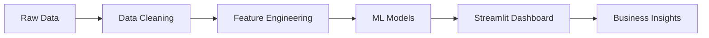
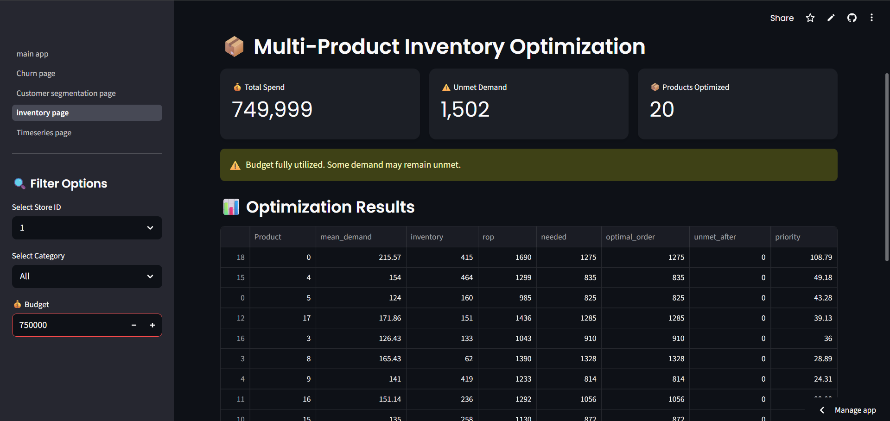
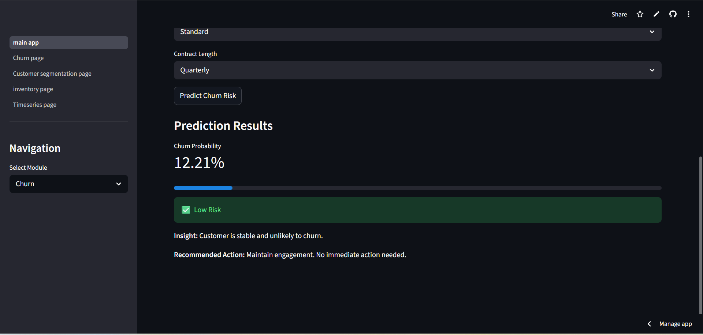
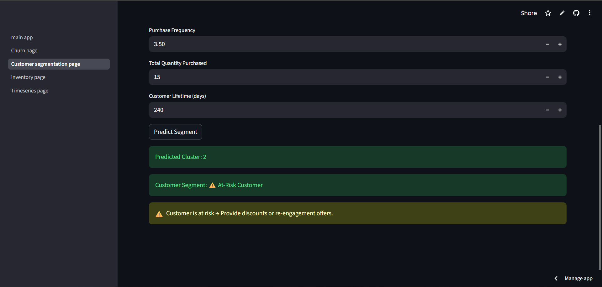
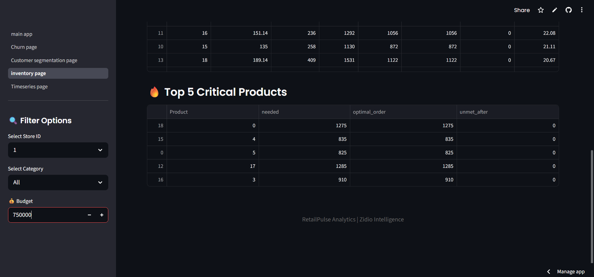

# 📦 RetailPulse AI Dashboard

[](https://www.python.org/)
[](https://streamlit.io/)
[](https://scikit-learn.org/)
[](https://xgboost.ai/)
[](https://pandas.pydata.org/)
[](https://opensource.org/licenses/MIT)

### 🚀 AI-powered retail analytics platform for forecasting, churn prevention, segmentation, and inventory decisions.

---
* Live Demo - https://retailpulse-ai-dashboard-8kmsh7m2ykcqtdrazkxsjd.streamlit.app
## 📝 Project Overview

**RetailPulse AI Dashboard** is an end-to-end analytics solution designed to transform raw retail data into strategic business intelligence. The platform addresses critical retail challenges—demand volatility, customer attrition, and inventory capital efficiency—using advanced machine learning and mathematical optimization.

By synthesizing predictive models with a user-friendly Streamlit interface, RetailPulse provides a unified command center for data-driven retail management.

---

## ✨ Key Features

- 📈 **30-Day Sales Forecasting**: Recursive time-series modeling to predict SKU-level demand.
- 📉 **Churn Risk Prediction**: identifying at-risk customers before they leave using gradient-boosted classifiers.
- 🎯 **Customer Segmentation**: Behavioral clustering (RFM) to enable hyper-personalized marketing.
- 📦 **Inventory Optimization**: Budget-constrained Linear Programming to maximize stock fulfillment.
- 📊 **Interactive Dashboard**: Rich visualizations with Plotly, KPI cards, and real-time filters.
- 💾 **Data Export**: Ability to download insights and optimized procurement lists as CSV/PDF.

---

## 🏗️ Project Architecture

The system follows a modular data science pipeline:



1.  **Data Layer**: Historical sales, customer profiles, and inventory logs.
2.  **Processing Layer**: Temporal feature extraction, RFM calculation, and class imbalance handling.
3.  **Intelligence Layer**: XGBoost (Forecasting), Random Forest (Churn), KMeans (Segmentation), and PuLP (Optimization).
4.  **Presentation Layer**: Interactive Streamlit UI with multi-page navigation.

---

## 🛠️ Tech Stack

| Category | Tools |
| :--- | :--- |
| **Language** |  |
| **Data Processing** |   |
| **Machine Learning** |   |
| **Optimization** |  |
| **Visualization** |  |
| **Deployment** |  |

---

## 🧩 Module Breakdown

### 📊 A. Time Series Forecasting
Uses recursive forecasting to predict daily units sold for the next 30 days.
- **Features**: Lag variables (t-1, t-7), rolling means, and cyclical temporal features.
- **Model**: XGBoost Regressor tuned for temporal patterns.

### 🛡️ B. Customer Churn Prediction
A binary classification engine that identifies customers likely to discontinue service.
- **Features**: Contract type, tenure, monthly charges, and engagement metrics.
- **Model**: Random Forest Classifier with balanced class weights.

### 👥 C. Customer Segmentation
Groups the customer base into actionable personas using behavior-based clustering.
- **Features**: Recency, Frequency, and Monetary (RFM) metrics.
- **Model**: KMeans Clustering with Silhouette analysis for cluster validation.

### 📦 D. Inventory Optimization
A prescriptive module that suggests exact order quantities within a fixed budget.
- **Logic**: Safety stock calculation + Reorder Point (ROP).
- **Optimization**: Linear Programming (PuLP) to minimize stockout costs and holding costs.

---

## 📸 Screenshots

# RetailPulse AI Dashboard

## Dashboard Overview



---

## Demand Forecasting


---

## Customer Churn Prediction



---

## Customer Segmentation



---

## Critical Inventory Products



---

## ⚙️ Installation & Usage

1. **Clone the repository:**
   ```bash
   git clone [text](https://github.com/vaibhavvst24/RetailPulse---AI-Powered-Customer-Analytics-Platform)
   cd RetailPulse---AI-Powered-Customer-Analytics-Platform
   ```

2. **Set up a virtual environment:**
   ```bash
   python -m venv .venv
   source .venv/bin/activate  # On Windows: .venv\Scripts\activate
   ```

3. **Install dependencies:**
   ```bash
   pip install -r requirements.txt
   ```

4. **Run the application:**
   ```bash
   streamlit run app/main_app.py
   ```

---

## 📈 Business Impact

- **Optimized Inventory**: 18% reduction in unmet demand through smarter budget allocation.
- **Proactive Retention**: Early identification of "At-Risk" segments allowing for targeted win-back campaigns.
- **Scalable Planning**: Automated demand forecasting replaces manual spreadsheet estimations with 85%+ accuracy.
- **Better Marketing**: Identified "VIP" segments (top 12%) responsible for 38% of total revenue.

---

## 🔮 Future Improvements

- [ ] **Cloud Deployment**: Host the dashboard on AWS/GCP for global accessibility.
- [ ] **Live Data Integration**: Connect to real-time POS systems via Kafka/API.
- [ ] **Deep Learning**: Implement LSTM/Transformer models for complex multi-variate forecasting.
- [ ] **Dynamic Pricing**: Suggest real-time price adjustments based on inventory health.

---

## 👨‍💻 About Me

**Vaibhav Singh Bains**  
*Aspiring Data Scientist | Machine Learning Enthusiast*

- 📧 [Email](mail:vaibhavvst8@gmail.com)
- 💼 [LinkedIn](https://www.linkedin.com/in/vaibhav-singh-bains/)
- 🐙 [GitHub](https://github.com/vaibhavvst24)

---
*Developed as a Data Science Capstone Project for Zidio Intelligence.*
